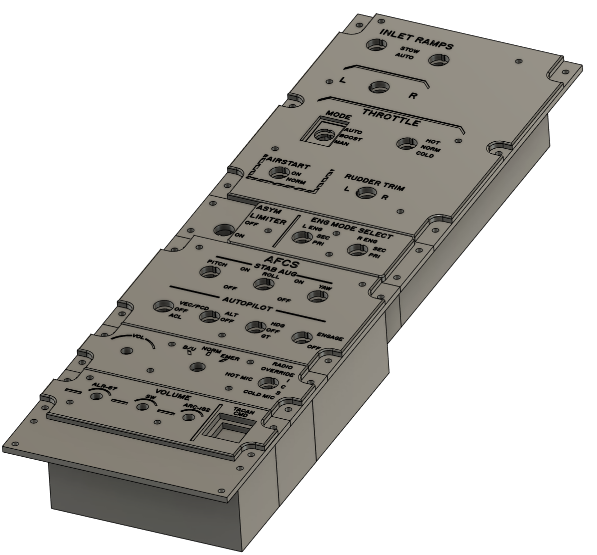

# Left Outboard

## BoM

### Throttle

- 12mm Toggle On-Off x3 [T8013](https://www.aliexpress.com/item/1005001315963290.html)
- 12mm Toggle On-Off-On x2 [T8014](https://www.aliexpress.com/item/1005001315963290.html)
- 12mm Toggle (On)-Off-(On) 

### Engine Asymmetric Limiter 

- 12mm Toggle On-Off x3 [T8013](https://www.aliexpress.com/item/1005001315963290.html)
- Switch Cover [RED](https://www.aliexpress.com/item/1005006832895893.html)

### AFCS

- 12mm Toggle On-Off x5 [T8013](https://www.aliexpress.com/item/1005001315963290.html)
- 12mm Toggle On-Off-On x2 [T8014](https://www.aliexpress.com/item/1005001315963290.html)

### ICS

- 12mm Toggle On-Off-On x1 [T8014](https://www.aliexpress.com/item/1005001315963290.html)
- 3 Way Rotary
- Potentiometer

### Volumes

- 3x Potentiometer 
- Lit Square Korry Style Switche x 1 [DIY737](https://www.737diysim.com/product-page/custom-dual-colour-korry-replica)

