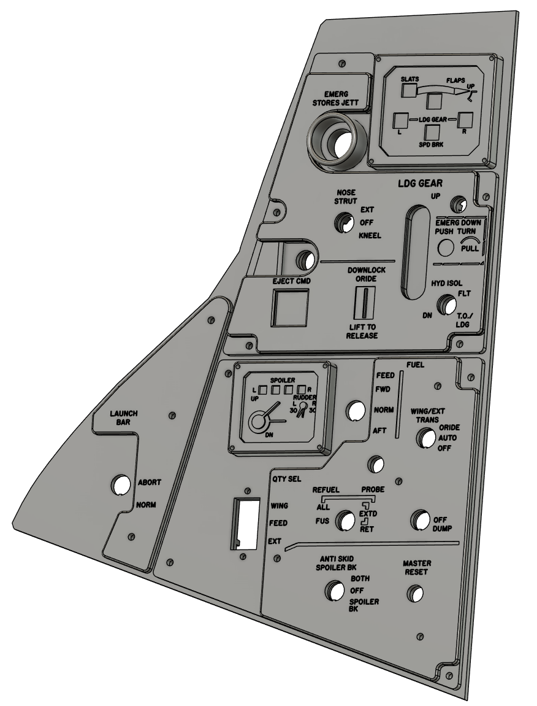

# Left Vertical Panel

Trim and Gear panels are non-functional and for display purposes only.

## BoM

### Gear Panel

- Emergency JETT - 16mm red push button [LINK](https://amzn.eu/d/eFpsVKk)

- Brakes - 10mm Push Pull Switch [LINK](https://www.aliexpress.com/item/1005007343801175.html)

### Fuel Panel

- Master Reset - 12mm Push Button Switch [R13-85](https://www.aliexpress.com/item/1042107033.html)

- Fuel Trans, Refuel, Spoiler Brakes - 3x On-Off-On 12mm Toggle [T8014](https://www.aliexpress.com/item/1005001315963290.html)

- Fuel Dump - On-Off 12mm Toggle  [T8013](https://www.aliexpress.com/item/1005001315963290.html)

- Quantity Switch - TBC

### Launch Bar

- Launch Abort - On-Off 12mm Toggle  [T8013](https://www.aliexpress.com/item/1005001315963290.html)

- Launch Abort Cover - [LINK](https://www.aliexpress.com/item/1005006832895893.html)
