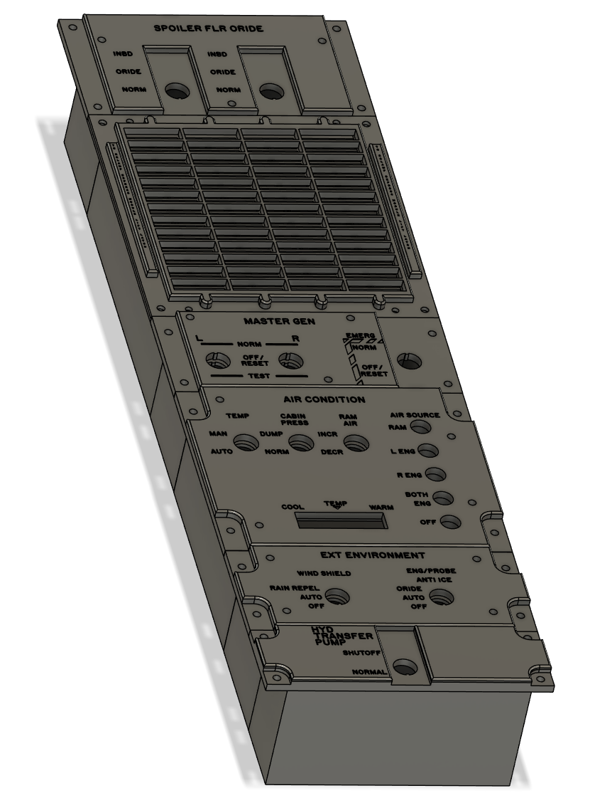

# Right Inboard 

## BoM

### Spoiler Override

- 12mm Toggle On-Off x1 [T8013](https://www.aliexpress.com/item/1005001315963290.html)
- Switch Cover [RED](https://www.aliexpress.com/item/1005006832895893.html)

### Caution and Warning

- 4mm LED holders x45 
- Yellow LED x35
- Green LED x10 

### Master Generator

- 12mm Toggle On-Off-On x2 [T8014](https://www.aliexpress.com/item/1005001315963290.html)
- 12mm Toggle On-Off x1 [T8013](https://www.aliexpress.com/item/1005001315963290.html)

### Air Condition

- 12mm Toggle On-Off x3 [T8013](https://www.aliexpress.com/item/1005001315963290.html)
- Piano Switches - Credit to user Hagen at DCS Forums [LINK](https://forum.dcs.world/topic/141193-f-14-cockpit-and-instrument-dimensions/page/38/)

### External Environment

- 12mm Toggle On-Off-On x2 [T8014](https://www.aliexpress.com/item/1005001315963290.html)

### Hydraulic Transfer Pump

- 12mm Toggle On-Off x1 [T8013](https://www.aliexpress.com/item/1005001315963290.html)
- Switch Cover [RED](https://www.aliexpress.com/item/1005006832895893.html)

