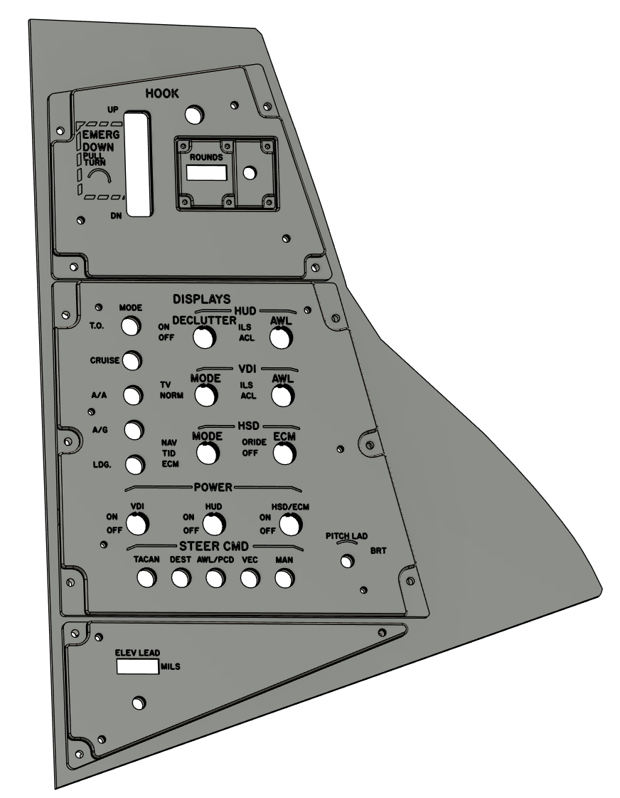

# Left Vertical Panel

## BoM

### Hook Panel

- Rotary Encoder
- 2mm clear acrylic window 24mm x 11mm

### PDCP

- 12mm Toggle On-Off x9
- Piano Switches - Credit to user Hagen at DCS Forums [LINK](https://forum.dcs.world/topic/141193-f-14-cockpit-and-instrument-dimensions/page/38/)
- Rotary Encoder

### Gun Elevation

- Rotary Encoder
- Tally Counter (Non functional) [LINK](https://amzn.eu/d/he2qN3s)
- 2mm clear acrylic window 25mm x 11mm

