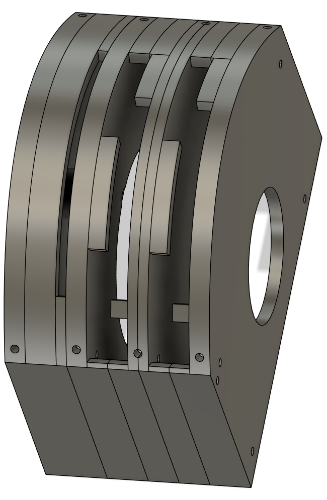

# Throttle Base

From left to right

- (Box/Left Plate)
- Flaps Box
- Throttle Levers Left Plate
- Throttle Levers Middle Left
- (Box/Center Plate)
- Throttle Levers Middle Right
- Throttle Levers Right Plate
- (Wingsweep)

## BoM

- 2x Rotary Damper in Left/Right Plates [ACE Controls FDT-70](https://www.acecontrols.co.uk/uk/products/motion-control/rotary-dampers/fdt/fdt/fdt-70.html)

- 2x Hall Effect Potentiometer in Center Plate [TT6127](https://www.ttelectronics.com/Products/Passive-Components/Potentiometers/6127)